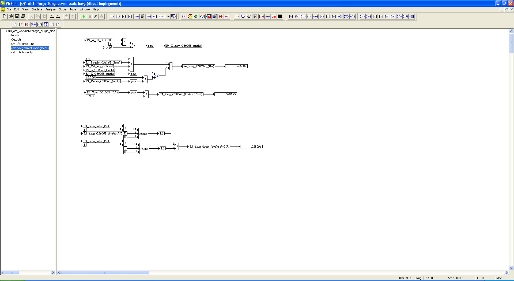

# ========================================
# Orbital Vehicle Purge Ring Simulation using VISSIM:
# ========================================

## Orbital Vehicle Purge Ring Simulation using VISSIM.

##
## I. Operation: "./VISSIM/OV_AFT_Purge_Ring_e.vsm"

##
## II. Purge Ring Top Level Diagram:

##
## III. Inputs Sub-System Level Diagram:

##
## IV. Outputs Sub-System Level Diagram:

##
## V. Purge Ring Sub-System Level Diagram:

##
## VI.  Average Enthalpy Calculation Sub-System Level Diagram:

##
## VII. Bulk Cavity Enthalpy Calculation Sub-System Level Diagram:

## 
## *Note: 
## 1. Performance Data and Analysis performed using VISSIM, ( https://web.solidthinking.com/vissim-is-now-solidthinking-embed )

